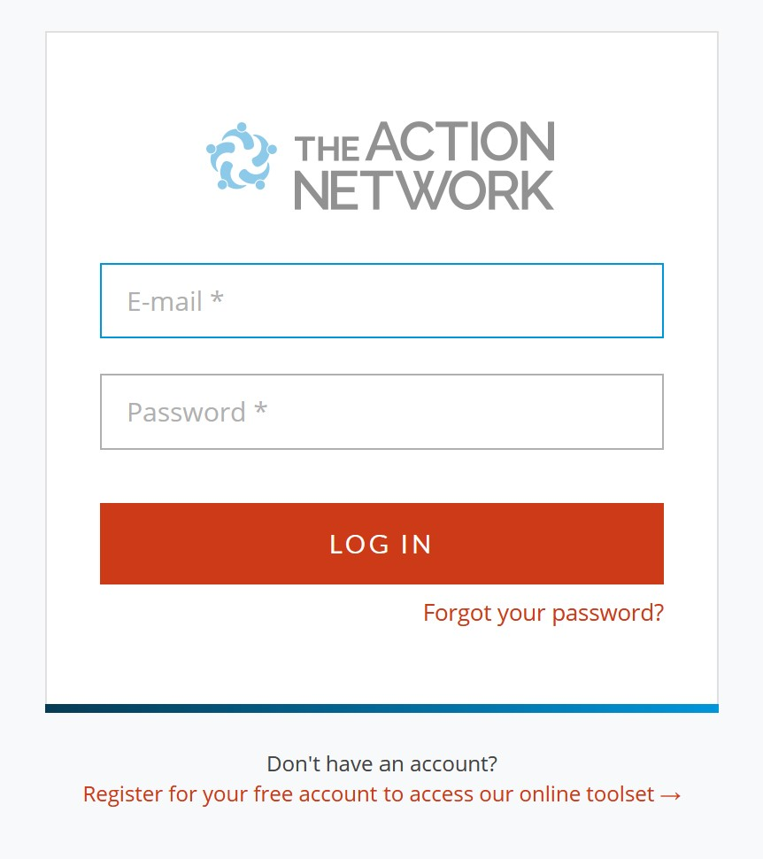

## What is Action Network?
Action network is where SS4C stores all the information of people who have signed up to SS4C - at an event, texted in, organised  a previous strike etc.
It allows us to:
- Send emails
- Search for contacts phone numbers, emails addresses,
- Create lists of phone numbers + email addresses of people who attended previous strikes

## Accounts
### How do I request an account?
:::note
Needs to be added
:::

### How do I log in?
1. First you need to go to the Action Network [sign in page](https://actionnetwork.org/users/sign_in). You can also access this from the [tech portal](https://tech.ss4c.info/access).
1. Log in with your School Strike email and the password you chose for Action Network. . Tada!
