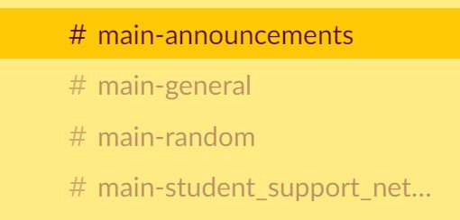

:::note
This page is not finished, and we would love help for content! Please message *Ambrose - Sydney (he/him)* on Slack with details on how to help.
:::

## What is Slack?

Slack is a communication app and website that SS4C uses to communicate. We use it for most  communication, organising actions, updates, connecting with your hub, local group and national team, to contact your mentors and seek advice. However some **local groups** may use different methods of communication like Instagram or Facebook . Within slack we have a system to keep things organised and easy to find.

## How do I use Slack?
### When joining
Please include in your profile the following:
- Your name
- Pronouns
- Location
- Whether you are an adult supporter

:::note

e.g @marcel - albury (he/him), @kate - adult supporter, syd (she/her) or @riley - perth (they/them). Inclusion of profile pictures is recommended, but entirely optional.

:::

### Channels
Conversations in Slack take place in discussion “channels”. To join channels relevant to you: click on the plus sign next to the “channels” heading on the left hand side bar and search for the channels relevant to you.



### State channels
- **#state-nsw**: for NSW strike convos
- **#state-wa**: for Western Australia strike convos
- **#state-vic**: for Victorian strike convos
- **#state-act**: for ACT/Canberra strike convos
- **#state-nt**: for Northern Territory strike convos
- **#state-qld**: for Queensland strike convos
- **#state-sa**: for South Australian strike convos
- **#state-tas**: for Tasmanian strike convos
- **#state-vic**: for Victorian strike convos

### National Channels
:::note
Before posting in national channels, think about whether what you’re posting is relevant to the entire national network. If not, use your state channel.
:::

- **#general**: for general updates relevant to the national network
- **#main-student-support-network**: a student-only support channel. Adults are NOT to join this channel.
- **#main-regional_support**: for regional and rural students to connect.
- **#main-announcements**: for announcements relevant to the national network.
- **#z-media**: for media coordination relevant to the national network
- **#z-social_media**: for social-media coordination relevant to the national network
- **#z-org_partnerships**: for partnerships with external  individuals/groups relevant to the national network

**There are many more channels, which can be viewed in the [Slack Directory](https://docs.google.com/spreadsheets/d/1UDz7h7hY0n-ladkcMnB5-Rl1Jq7XabLUv2LgQEkZ52M/edit?usp=sharing)** - to add channels, click on the plus sign next to the “channels” heading on the left hand side bar and search for the channels relevant to you.

**If you would like a channel to be created, please speak to a member of the tech and digital team or message the #z-tech_support channel.**

**A summary of all working groups can be found at [Working Group Blurbs](https://docs.google.com/document/d/1vkzcfpoF-U9D3g2G5xx_aoAizdhdhUtzGvjkLInjUl8/edit?usp=sharing)** - these are long-term groups who play an ongoing role in our network, including First Nations justice, Onboarding and mediation.

**To keep conversations organised we use *'threads'*.** Instead of replying to someone in a new message, hover over the original message and click the “start thread” speech bubble. If there are already replies on a message, simply click to open before adding your own. This prevents individuals in the network from being flooded with notifications that may not concern them.

**To invite an existing member of your team to join the national school strike slack** please message [#z-tech_support](https://ss4c-au.slack.com/archives/CSUVDRA21) for help.

**To invite a new friend to the team** please ask them to [sign up](https://www.schoolstrike4climate.com/join) on our website.

:::important
**It goes without saying, but let’s ensure that all communication within the network and on Slack is respectful, inclusive and relevant to the mission of awesome school student-led climate action.** Please keep the mental health and wellbeing of every member of the network in mind when communicating with others. This means only inviting people to Slack who you know and trust will help to maintain the brilliant school strike culture that we are all building. ❤
:::

## How do I get the most out of Slack?
### Keyboard Shortcuts
Keyboard shortcuts help you navigate Slack with minimal effort. You can see a quick list of shortcuts by pressing ```⌘``` + ```/``` (Mac) and ```Ctrl``` + ```/``` (Windows/Linux), or take a look at the detailed lists below.

:::note
Basic shortcuts will be added to this page at some point when we're bothered.
:::

For the full list of shortcuts click [here](https://slack.com/intl/en-gb/help/articles/201374536-Slack-keyboard-shortcuts).

### How do I personalise Slack?
#### Notifications
Woah you can change your notification noise for each workspace (hummus is a popular one in the climate space). Someone please add to this


:::tip
1. From your desktop, click on your profile picture in the top right.
1. Select Preferences from the menu to open your notification preferences.
1. Under Sound & appearance, choose how your notifications will look, sound and behave.
:::


If at any point you need help with tech - post what you need help with on #z-tech_support and the awesome team can help you out.


This is a link to [another document.](doc3.md) This is a link to an [external page.](http://www.example.com/)
